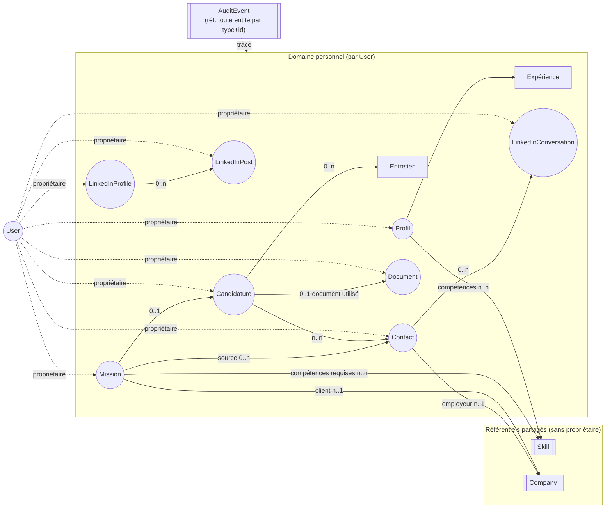

# Domain Model — Memory Agent

Statut : proposition v3, en attente de validation. Aucune implémentation à ce stade.

Historique :
- v1 validée le 2026-07-12 (entités cœur du pipeline candidature).
- v2 : ajout de Skill, Company, Document, l'écosystème LinkedIn et un système de tags transverse.
- v3 (cette version) : ajout de `User` et du rattachement des agrégats à leur propriétaire, formalisation de la frontière données personnelles / référentiels partagés, ajout de `AuditEvent` pour la traçabilité, généralisation de `Source` aux données importées (missions, contacts, documents).

## Pourquoi ce document

`memory-agent` est désigné comme la source de vérité unique de la plateforme (voir `README.md`, `CLAUDE.md`). Avant de l'implémenter, on fixe son modèle de domaine : quelles sont les notions métier qu'il porte, comment elles s'articulent, et quel contrat il expose aux autres agents (`mission-agent`, `cv-agent`, `linkedin-agent`, `recruiter-agent`, `interview-agent`, `dashboard-agent`).

Le domaine couvert ici est délimité par ce que `memory-agent` possède réellement : l'**utilisateur** propriétaire des données, son **profil** (y compris sa présence LinkedIn), son **référentiel de compétences et d'entreprises**, ses **documents de candidature**, l'**historique de sa recherche de mission**, et la **traçabilité** de tout changement. Il ne couvre pas la logique de scraping (`mission-agent`), de génération de contenu (`cv-agent`, `linkedin-agent`) ou de rendu (`frontend`/`dashboard-agent`) — ces agents consomment le modèle ci-dessous, ils ne le dupliquent pas.

---

## 1. Entités métier

Une entité a une identité stable et un cycle de vie (elle change d'état dans le temps, mais reste "la même").

| Entité | Description |
|---|---|
| **User** | *(nouveau)* Le titulaire du compte : la personne au nom de laquelle `memory-agent` conserve profil, missions, candidatures et contenus. Aujourd'hui, une seule instance existe (Jamal) ; le modèle n'exclut pas d'en accueillir d'autres sans changer sa structure. |
| **Profil** | Identité professionnelle d'un `User` : titre, résumé, expériences, préférences de mission. |
| **Expérience** | Une expérience professionnelle passée (mission ou poste) : entreprise/client, intitulé, période, compétences mobilisées, réalisations. |
| **Skill** | Une compétence référencée dans un vocabulaire commun (ex. "React", "Terraform", "Négociation client"). Référentiel partagé : `Profil` et `Mission` la référencent par identifiant plutôt que de dupliquer un libellé libre. |
| **Company** | Une entreprise : client final, ESN, cabinet de recrutement. Référentiel partagé, référencée par `Mission` (client) et `Contact` (employeur). |
| **Mission** | Une opportunité détectée (par `mission-agent`) : offre de mission/poste IT, avec sa description, son client (`Company`), sa source d'import, son TJM annoncé. Existe indépendamment de toute candidature. |
| **Candidature** | L'acte de postuler à une `Mission` donnée. Porte le statut du pipeline et son historique. |
| **Entretien** | Un entretien réalisé ou planifié, rattaché à une `Candidature`. Porte la préparation et le compte-rendu. |
| **Contact** | Une personne rencontrée dans le processus : recruteur, manager, cooptation. Rattachée à une `Company`. |
| **Document** | Un document de candidature versionné : CV (de référence ou adapté), lettre de motivation, portfolio. `memory-agent` ne porte que la référence et les métadonnées, jamais le contenu. |
| **LinkedInProfile** | État de la présence LinkedIn d'un `User` : titre affiché, résumé, sections mises en avant, date de dernière synchronisation. |
| **LinkedInPost** | Un contenu publié ou planifié sur LinkedIn : texte, statut, date, métriques une fois publié. |
| **LinkedInConversation** | Un échange de messages LinkedIn avec un `Contact` : historique des messages, statut. |
| **AuditEvent** | *(nouveau)* Trace immuable d'un changement survenu sur une entité du domaine : qui/quoi en est à l'origine (utilisateur ou agent), quelle entité a changé, quand, avec quel avant/après. Support de la traçabilité, distinct des événements métier "en vol" (section 10) qu'il persiste. |

Sauf mention contraire, toute entité listée ci-dessus **hors `Skill` et `Company`** (référentiels partagés, voir section 3) appartient à exactement un `User` — voir section 5 pour le détail du rattachement.

## 2. Relations entre entités

Points clés :
- **User** est la racine de propriété : chaque agrégat du "domaine personnel" porte un `propriétaireId` (voir section 5). `Skill` et `Company` n'ont pas de propriétaire — ce sont des référentiels partagés (voir section 3).
- **Mission** et **Candidature** restent deux entités distinctes : une mission peut être écartée sans jamais devenir une candidature.
- **Document** est référencé par `Candidature` mais existe indépendamment : un CV adapté peut être généré pour une `Mission` avant toute décision de candidature.
- **LinkedInProfile**, **LinkedInPost**, **LinkedInConversation** forment un sous-domaine autonome, écrit par `linkedin-agent`, lu par `dashboard-agent`.
- **AuditEvent** ne fait pas partie du graphe de relations métier : c'est un journal transverse qui référence n'importe quelle entité par `(type, id)`, représenté à part pour ne pas alourdir le diagramme.

## 3. Frontière : données personnelles vs référentiels partagés

Deux catégories bien séparées, avec une règle de dépendance à sens unique :

- **Données personnelles** (portent un `propriétaireId: UserId`) : `Profil`, `Expérience`, `Mission`, `Candidature`, `Entretien`, `Contact`, `Document`, `LinkedInProfile`, `LinkedInPost`, `LinkedInConversation`. Elles appartiennent à un seul `User` et ne sont jamais lisibles/modifiables en dehors de son contexte.
- **Référentiels partagés** (pas de propriétaire) : `Skill`, `Company`. Réutilisables par tout `User` présent ou futur, gérés en déduplication (par nom/alias).

Règle de dépendance : une entité personnelle peut référencer un référentiel partagé (`Mission → Company`, `Profil → Skill`), jamais l'inverse — un référentiel ne connaît pas ses utilisateurs. Ça garantit que `Skill`/`Company` restent réutilisables sans coupler leur cycle de vie à celui d'un utilisateur particulier.

Conséquences pour l'implémentation (Sprint 2) :
- Les repositories des agrégats personnels exposent une méthode `parPropriétaire(userId)` (section 11) ; les repositories `Skill`/`Company` n'en ont pas.
- Tant que l'application reste mono-utilisateur, les cas d'usage (section 12) s'exécutent dans le contexte implicite du `User` courant — pas besoin de faire remonter un paramètre `userId` explicite partout dans les signatures d'agent, mais la donnée est toujours scopée en base.

Cas limite identifié, non retenu pour ce sprint : si plusieurs utilisateurs venaient à voir la même annonce, `Mission` pourrait être scindée en une "Offre" partagée (dédupliquée par URL) et une "Qualification" personnelle. Prématuré aujourd'hui (un seul `User` réel) — noté en points à valider pour ne pas fermer la porte plus tard.

## 4. Responsabilités de chaque entité

- **User**
  - Garantir l'unicité de l'identité (email unique).
  - Être le point de rattachement de toute donnée personnelle ; sa désactivation doit être tracée (`AuditEvent`) et pose la question du sort des agrégats liés (voir points à valider).
- **Profil**
  - Garantir la cohérence des données professionnelles (dates d'expérience valides, préférences cohérentes).
  - Exposer les critères de qualification courants utilisés par `mission-agent`.
- **Expérience**
  - Décrire une période professionnelle passée de façon autonome (utilisable telle quelle par `cv-agent`).
- **Skill**
  - Garantir l'unicité d'une compétence dans le référentiel (déduplication par nom/alias).
  - Porter une catégorie stable réutilisée pour le scoring de `mission-agent` et la mise en forme de `cv-agent`.
- **Company**
  - Centraliser l'identité d'une entreprise pour éviter les doublons entre missions et contacts.
- **Mission**
  - Conserver les données brutes/qualifiées d'une opportunité, indépendamment de la décision d'y postuler.
  - Porter sa `Source` d'import, pour permettre la déduplication au ré-import (voir section 8).
  - Porter le résultat de qualification produit par `mission-agent`.
- **Candidature**
  - Détenir le statut courant du pipeline et faire respecter les transitions valides.
  - Historiser chaque changement de statut.
  - Référencer le `Document` utilisé, sans en porter le contenu.
- **Entretien**
  - Porter la préparation et le compte-rendu post-entretien.
- **Contact**
  - Centraliser les coordonnées et l'historique relationnel avec une personne.
  - Porter sa `Source` (comment ce contact est entré en relation).
- **Document**
  - Tracer les versions d'un document de candidature et leur destination.
  - Porter sa `Source` (généré par `cv-agent` vs. importé manuellement).
- **LinkedInProfile**
  - Refléter l'état courant de la présence LinkedIn et son historique de synchronisation.
- **LinkedInPost**
  - Suivre le cycle de vie d'un contenu LinkedIn de la rédaction à la publication.
- **LinkedInConversation**
  - Conserver l'historique d'échange avec un contact sur LinkedIn.
- **AuditEvent**
  - Enregistrer un fait accompli, jamais le modifier (immuable, append-only).
  - Porter assez de contexte (type d'entité, id, acteur, avant/après) pour reconstituer un historique sans interroger les agrégats métier eux-mêmes.

## 5. Agrégats

Un agrégat définit une frontière de cohérence : on ne modifie ses entités internes qu'à travers sa racine, et les autres agrégats ne le référencent que par identifiant.

| Agrégat (racine) | Entités/VO inclus | Invariants portés | Propriétaire |
|---|---|---|---|
| **User** | StatutCompte (VO) | Email unique | — (racine de propriété) |
| **Profil** | Expérience(s), CompétenceProfil (VO → `SkillId`), PréférencesDeMission (VO), CritèresDeQualification (VO) | Un seul profil actif par `User` ; pas de `SkillId` dupliqué ; préférences cohérentes. | `UserId` |
| **Skill** | Alias (VO) | Nom canonique unique dans le référentiel. | — (référentiel partagé) |
| **Company** | Localisation (VO) | Nom unique dans le référentiel. | — (référentiel partagé) |
| **Mission** | StatutDeQualification (VO), Source (VO), CompétenceRequise (VO → `SkillId`), Tags | Référence exactement une `CompanyId` ; une mission qualifiée porte toujours un score. | `UserId` |
| **Candidature** | Entretien(s), HistoriqueStatut (VO), Tags | Transitions de statut valides ; rattachée à exactement une `MissionId`. | `UserId` |
| **Contact** | ContactInfo (VO), Source (VO), Tags | Email/identifiant LinkedIn unique ; référence au plus une `CompanyId`. | `UserId` |
| **Document** | Version (VO), Source (VO), Tags | Chaque version a une référence de fichier unique ; rattachée à au plus une `MissionId`/`CandidatureId`. | `UserId` |
| **LinkedInProfile** | Historique de synchronisation (VO) | Une seule instance active par `User`. | `UserId` |
| **LinkedInPost** | Métriques (VO), Tags | Transitions `Brouillon → Planifié → Publié` cohérentes ; référence `LinkedInProfileId`. | `UserId` (via `LinkedInProfile`) |
| **LinkedInConversation** | Message (VO), Tags | Rattachée à exactement une `ContactId`. | `UserId` |
| **AuditEvent** | Acteur (VO), Détails (VO) | Immuable une fois créé (pas de mise à jour, pas de suppression). | rattaché à un `Acteur`, pas un "propriétaire" au sens métier |

Règle générale de référencement : `Candidature` référence `MissionId`, `ContactId[]` et `DocumentId` ; `Mission` référence `CompanyId` et `SkillId[]` ; `Contact` référence `CompanyId` ; `LinkedInPost` référence `LinkedInProfileId` ; `LinkedInConversation` référence `ContactId` — toujours par identifiant, jamais par objet complet, pour préserver l'indépendance des agrégats.

## 6. Value Objects

Sans identité propre ; deux VO avec les mêmes attributs sont interchangeables ; immuables.

- **StatutCompte** — `Actif / Désactivé`.
- **CompétenceProfil** — `SkillId`, niveau (junior/confirmé/expert), années d'expérience associées.
- **CompétenceRequise** — `SkillId`, niveau requis, obligatoire/souhaitée.
- **Alias** — libellé alternatif d'un `Skill` (ex. "JS" pour "JavaScript"), pour la déduplication.
- **Localisation** — ville, pays, coordonnées optionnelles.
- **TJM** — montant, devise, unité (jour/heure), éventuellement `TJM { min, max }`.
- **PériodeDisponibilité** — date de début, date de fin optionnelle.
- **LocalisationPréférence** — remote (total/partiel/non), ville de base, périmètre accepté.
- **CritèresDeQualification** — TJM minimum, remote requis, `SkillId[]` recherchés/exclus, types de contrat acceptés, secteurs exclus.
- **PériodeExpérience** — date de début, date de fin (ou "en cours").
- **StatutCandidature** — `Repérée → Postulée → EntretienPlanifié → EntretienRéalisé → OffreReçue → Acceptée`, ou `… → Refusée / SansRéponse / Abandonnée` à toute étape.
- **StatutDeQualification** — `NonQualifiée / Qualifiée / Écartée`, avec score et motif.
- **ContactInfo** — email, téléphone, URL LinkedIn.
- **Version** *(document)* — numéro/label de version, date de création, `RéférenceFichier`.
- **RéférenceFichier** — pointeur logique vers un fichier de `data/`/`knowledge/`, jamais le contenu.
- **StatutPost** — `Brouillon / Planifié / Publié / Archivé`.
- **Métriques** *(LinkedIn)* — vues, réactions, commentaires, date de mesure.
- **Message** — expéditeur (Jamal/contact), contenu, horodatage.
- **Tag** — libellé court + catégorie optionnelle, porté en liste par les entités listées en section 7.
- **Source** *(généralisée, détail section 8)* — type, référence externe, agent responsable, date d'import.
- **Acteur** *(détail section 9)* — type (`Utilisateur` / `Agent`), identifiant.
- **Détails** *(AuditEvent, détail section 9)* — contexte libre avant/après associé à un `AuditEvent`.

## 7. Système de tags

Un tag est un VO simple (`libellé`, `catégorie?`) porté en liste par les entités qui ont besoin d'un classement libre, en complément de leurs attributs structurés :

- **Mission** (ex. `urgent`, `remote-only`, `secteur-finance`)
- **Candidature** (ex. `relance-prioritaire`)
- **Contact** (ex. `réseau-chaud`, `chasseur-tête`)
- **Company** (ex. `grand-compte`, `startup`, `ESN`)
- **Document** (ex. `version-courte`, `anglais`)
- **LinkedInPost** (ex. `thème-cloud`, `retour-expérience`)
- **LinkedInConversation** (ex. `à-relancer`)

`Profil`, `Skill`, `Expérience`, `Entretien` et `User` n'en portent pas : `Skill` a déjà une catégorie structurée, `Profil`/`User` n'ont pas besoin d'être classés, `Expérience`/`Entretien` sont consultés via leur agrégat parent.

Un tag est toujours interprété dans le contexte du `User` propriétaire de l'entité taguée — il n'y a pas de tags partagés entre utilisateurs, y compris sur `Company` (deux `User` peuvent tagguer la même entreprise différemment... **sauf que `Company` est un référentiel partagé sans propriétaire** ; ses tags sont donc, eux, globaux. C'est noté explicitement en points à valider tant qu'il n'y a qu'un seul `User` réel — le comportement souhaité à plusieurs utilisateurs reste à trancher.

## 8. Provenance des données importées (Source)

`Mission`, `Contact` et `Document` peuvent provenir d'un import externe (scraping par `mission-agent`, capture LinkedIn par `linkedin-agent`, dépôt manuel d'un CV). Le VO **Source** capture cette provenance de façon uniforme :

- **type** — `LinkedIn`, `PlateformeFreelance`, `RéseauPersonnel`, `Cooptation`, `CandidatureSpontanée`, `SaisieManuelle`, `GénérationAgent`…
- **référenceExterne** *(optionnelle)* — identifiant/URL dans le système d'origine (ex. URL d'une offre, ID d'un post LinkedIn). Sert de clé de déduplication au ré-import.
- **agentResponsable** — quel agent (ou action humaine) a produit la donnée (`mission-agent`, `linkedin-agent`, `cv-agent`, `utilisateur`).
- **importéLe** — date de capture/import.

Usage type : quand `mission-agent` redécouvre une offre déjà connue, `EnregistrerMissionDécouverte` (section 12) doit d'abord chercher une `Mission` existante via `MissionRepository.parRéférenceExterne` (section 11) avant d'en créer une nouvelle — `référenceExterne` est donc la clé d'idempotence de l'import, pas un simple champ d'affichage.

`LinkedInPost` et `LinkedInConversation` peuvent également porter une `Source` (capture d'un post ou d'une conversation déjà existante) mais ce n'est pas leur mode de création principal, qui est plutôt la planification/l'échange en direct.

## 9. Traçabilité et audit (AuditEvent)

Distinction avec la section 10 (« Événements métier ») : ces derniers sont des signaux ponctuels destinés à l'intégration entre agents (déclenchement réactif — ex. `MissionQualifiée` peut déclencher `cv-agent`). `AuditEvent` en est la **persistance durable et interrogeable** : chaque occurrence d'un événement métier de la section 10 donne lieu à exactement un `AuditEvent` enregistré.

Structure :
- **horodatage**
- **typeÉvénement** — reprend un des noms listés en section 10 (ex. `StatutCandidatureChangé`)
- **entitéConcernée** — type + id (ex. `Candidature`, `cand_123`)
- **acteur** (VO `Acteur`) — qui/quoi a déclenché le changement : un `User` (action explicite depuis `dashboard-agent`/`frontend`) ou un agent autonome (`mission-agent`, `linkedin-agent`…). C'est ce qui permet de distinguer une action humaine d'une action automatisée dans l'historique.
- **détails** (VO `Détails`) — contexte libre (avant/après, ou payload de l'événement d'origine).

Invariant : **append-only** — un `AuditEvent` ne se modifie ni ne se supprime jamais après création. C'est la réponse concrète à l'ancienne question ouverte « persistance des événements : journal ou event sourcing ? » — on retient ici un **journal append-only simple**, pas un event-sourcing complet (le journal ne sert pas de source de vérité pour reconstruire l'état des agrégats, seulement à la traçabilité/consultation).

## 10. Événements métier

Émis par les agrégats à chaque changement d'état significatif ; consommés par les autres agents (notification, mise à jour de `dashboard-agent`, déclenchement de `cv-agent`/`interview-agent`) et systématiquement persistés en `AuditEvent` (section 9).

**Comptes**
- `UserCréé` / `UserDésactivé`

**Profil**
- `ProfilCréé`
- `CompétenceProfilAjoutée` / `CompétenceProfilRetirée`
- `ExpérienceAjoutée`
- `CritèresDeQualificationModifiés`

**Référentiels**
- `SkillCréé` / `SkillFusionné`
- `CompanyCréée` / `CompanyMiseÀJour`

**Missions**
- `MissionDécouverte`
- `MissionQualifiée` / `MissionÉcartée`

**Candidatures**
- `CandidatureCréée`
- `StatutCandidatureChangé`
- `DocumentAssociéÀCandidature`
- `CandidatureClôturée`

**Entretiens**
- `EntretienPlanifié`
- `EntretienRéalisé`

**Contacts**
- `ContactAjouté` / `ContactMisÀJour`

**Documents**
- `DocumentCréé` / `NouvelleVersionDocumentAjoutée`

**LinkedIn**
- `LinkedInProfileSynchronisé`
- `LinkedInPostPlanifié` / `LinkedInPostPublié` / `MétriquesPostMisesÀJour`
- `LinkedInConversationOuverte` / `MessageEnregistré`

**Transverse**
- `TagAjouté` / `TagRetiré`

## 11. Interfaces de repository

Définies au niveau conceptuel (contrat, pas de code) — un repository par agrégat, aucune fuite de logique métier vers l'infrastructure. Sauf mention contraire, les méthodes des agrégats personnels sont implicitement scopées à un `UserId`.

**UserRepository**
- `parId(id: UserId) -> User | absent`
- `parEmail(email: string) -> User | absent`
- `sauvegarder(user: User) -> void`

**ProfilRepository**
- `getProfil(userId: UserId) -> Profil`
- `sauvegarder(profil: Profil) -> void`

**SkillRepository** *(référentiel partagé, pas de filtrage par propriétaire)*
- `parId(id: SkillId) -> Skill | absent`
- `parNomOuAlias(libellé: string) -> Skill | absent`
- `lister(catégorie?) -> Skill[]`
- `sauvegarder(skill: Skill) -> void`

**CompanyRepository** *(référentiel partagé)*
- `parId(id: CompanyId) -> Company | absent`
- `parNom(nom: string) -> Company | absent`
- `sauvegarder(company: Company) -> void`

**MissionRepository**
- `parId(id: MissionId) -> Mission | absent`
- `parPropriétaire(userId: UserId) -> Mission[]`
- `parRéférenceExterne(ref: string) -> Mission | absent` (déduplication à l'import)
- `parSource(source: Source) -> Mission[]`
- `parStatutDeQualification(statut) -> Mission[]`
- `parTag(tag: Tag) -> Mission[]`
- `sauvegarder(mission: Mission) -> void`

**CandidatureRepository**
- `parId(id: CandidatureId) -> Candidature | absent`
- `parPropriétaire(userId: UserId) -> Candidature[]`
- `parMission(id: MissionId) -> Candidature | absent`
- `parStatut(statut: StatutCandidature) -> Candidature[]`
- `listerActives(userId: UserId) -> Candidature[]`
- `sauvegarder(candidature: Candidature) -> void`

**ContactRepository**
- `parId(id: ContactId) -> Contact | absent`
- `parPropriétaire(userId: UserId) -> Contact[]`
- `parEmail(email: string) -> Contact | absent`
- `parRéférenceExterne(ref: string) -> Contact | absent`
- `parCompany(id: CompanyId) -> Contact[]`
- `sauvegarder(contact: Contact) -> void`

**DocumentRepository**
- `parId(id: DocumentId) -> Document | absent`
- `parPropriétaire(userId: UserId) -> Document[]`
- `parCandidature(id: CandidatureId) -> Document[]`
- `parMission(id: MissionId) -> Document[]`
- `sauvegarder(document: Document) -> void`

**LinkedInProfileRepository**
- `getProfile(userId: UserId) -> LinkedInProfile`
- `sauvegarder(profile: LinkedInProfile) -> void`

**LinkedInPostRepository**
- `parId(id: LinkedInPostId) -> LinkedInPost | absent`
- `parPropriétaire(userId: UserId) -> LinkedInPost[]`
- `parStatut(statut: StatutPost) -> LinkedInPost[]`
- `sauvegarder(post: LinkedInPost) -> void`

**LinkedInConversationRepository**
- `parId(id: LinkedInConversationId) -> LinkedInConversation | absent`
- `parPropriétaire(userId: UserId) -> LinkedInConversation[]`
- `parContact(id: ContactId) -> LinkedInConversation[]`
- `sauvegarder(conversation: LinkedInConversation) -> void`

**AuditEventRepository** *(append-only : pas de méthode de mise à jour/suppression)*
- `enregistrer(event: AuditEvent) -> void`
- `parEntité(typeEntité: string, id: string) -> AuditEvent[]`
- `parPropriétaire(userId: UserId, période?) -> AuditEvent[]`
- `parActeur(acteur: Acteur) -> AuditEvent[]`

Chaque repository ne manipule que la racine de son agrégat (ex. on ne "sauvegarde" pas un `Entretien` seul, on sauvegarde la `Candidature` qui le contient).

## 12. Cas d'utilisation

Ce que `memory-agent` expose réellement aux autres agents — chaque cas d'usage correspond à une intention métier, pas à un CRUD brut. Sauf mention contraire, chaque cas d'usage s'exécute dans le contexte d'un `User` (implicite tant que l'app reste mono-utilisateur).

**Comptes utilisateurs**
- `CréerUser`
- `ConsulterUser`
- `DésactiverUser`

**Gestion du profil**
- `ConsulterProfil` — lecture par tous les agents.
- `AjouterCompétenceAuProfil` / `RetirerCompétenceDuProfil`
- `AjouterExpérience`
- `DéfinirCritèresDeQualification`
- `DéfinirPréférencesDeMission`

**Référentiels**
- `RéférencerOuRéutiliserSkill` — appelé par tout agent avant de créer une référence à une compétence.
- `FusionnerSkills`
- `RéférencerOuRéutiliserCompany`
- `MettreÀJourCompany`

**Missions**
- `EnregistrerMissionDécouverte` — vérifie d'abord `parRéférenceExterne` (déduplication) avant de créer.
- `QualifierMission`
- `ConsulterMissionsQualifiées`

**Candidatures**
- `CréerCandidature`
- `ChangerStatutCandidature`
- `AssocierDocumentUtilisé`
- `ConsulterPipelineCandidatures`
- `ClôturerCandidature`

**Entretiens**
- `PlanifierEntretien`
- `EnregistrerCompteRenduEntretien`
- `ConsulterHistoriqueEntretiens`

**Contacts**
- `AjouterContact` / `MettreÀJourContact`
- `ConsulterContactsParCandidature` / `ConsulterContactsParMission` / `ConsulterContactsParCompany`

**Documents**
- `EnregistrerDocument`
- `ConsulterDocumentsParCandidature` / `ConsulterDocumentsParMission`

**LinkedIn**
- `SynchroniserLinkedInProfile`
- `ConsulterLinkedInProfile`
- `PlanifierLinkedInPost` / `PublierLinkedInPost` / `EnregistrerMétriquesPost`
- `OuvrirLinkedInConversation` / `EnregistrerMessage`
- `ConsulterConversationsParContact`

**Tags (transverse)**
- `TaguerEntité(typeEntité, id, tag)` / `RetirerTag(typeEntité, id, tag)`
- `ConsulterParTag(typeEntité, tag)`

**Audit (transverse, lecture seule — l'écriture est un effet de bord automatique des autres cas d'usage)**
- `ConsulterHistoriqueParEntité(typeEntité, id)`
- `ConsulterHistoriqueParUtilisateur(userId, période?)`

---

## Points à valider avant implémentation

1. **StatutCandidature** : machine à états (`Repérée → Postulée → EntretienPlanifié → EntretienRéalisé → OffreReçue → Acceptée`, sorties `Refusée/SansRéponse/Abandonnée`) — toujours à confirmer, cf. `agents/recruiter-agent/README.md`.
2. **Déduplication `Skill`/`Company`** : stratégie de matching (nom exact, alias, similarité floue) à définir.
3. **Relation Mission ↔ Company** : un seul `CompanyId` (contractant direct) avec le rôle porté par un `Tag` (`intermédiaire`/`client-final`), plutôt qu'une relation dédiée client final/intermédiaire — à confirmer.
4. **Suppression/désactivation d'un `User`** : que deviennent ses agrégats (cascade, anonymisation, conservation pour audit) ? Impacte directement `DésactiverUser` et la politique de rétention des `AuditEvent` associés.
5. **Granularité de `AuditEvent`** : un événement par cas d'usage exécuté (proposé ici), ou un événement par changement de champ ? Impacte le volume stocké et le contenu du VO `Détails`.
6. **Rétention de `AuditEvent`** : durée de conservation, purge éventuelle si `Détails` contient des données personnelles.
7. **Tags sur `Company`** : `Company` est un référentiel partagé sans propriétaire, mais ses tags sont listés comme utiles (`grand-compte`, `ESN`) — à trancher : tags globaux sur `Company`, ou déplacés vers une relation `User`↔`Company` propre à chaque utilisateur ? Sans conséquence tant qu'il n'y a qu'un seul `User` réel.
8. **Scission future de `Mission`** (Offre partagée + Qualification personnelle) : non retenue pour ce sprint (mono-utilisateur), mais à garder en tête comme extension possible sans rupture du modèle si l'app devient multi-utilisateur.
