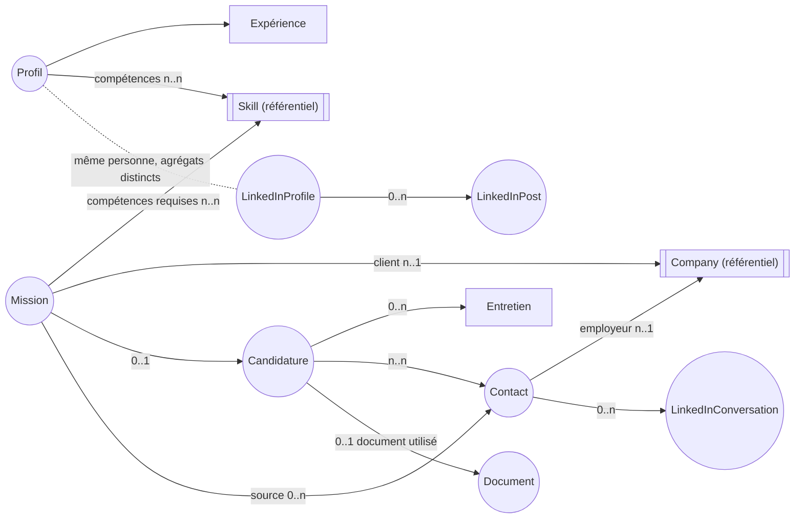

# Domain Model — Memory Agent

Statut : proposition v2, en attente de validation. Aucune implémentation à ce stade.

Historique : v1 validée le 2026-07-12 (entités cœur du pipeline candidature). v2 ajoute Skill, Company, Document, l'écosystème LinkedIn et un système de tags transverse.

## Pourquoi ce document

`memory-agent` est désigné comme la source de vérité unique de la plateforme (voir `README.md`, `CLAUDE.md`). Avant de l'implémenter, on fixe son modèle de domaine : quelles sont les notions métier qu'il porte, comment elles s'articulent, et quel contrat il expose aux autres agents (`mission-agent`, `cv-agent`, `linkedin-agent`, `recruiter-agent`, `interview-agent`, `dashboard-agent`).

Le domaine couvert ici est délimité par ce que `memory-agent` possède réellement : le **profil** de Jamal (y compris sa présence LinkedIn), son **référentiel de compétences et d'entreprises**, ses **documents de candidature**, et l'**historique de sa recherche de mission** (missions vues, candidatures, entretiens, contacts, échanges LinkedIn). Il ne couvre pas la logique de scraping (`mission-agent`), de génération de contenu (`cv-agent`, `linkedin-agent`) ou de rendu (`frontend`/`dashboard-agent`) — ces agents consomment le modèle ci-dessous, ils ne le dupliquent pas.

---

## 1. Entités métier

Une entité a une identité stable et un cycle de vie (elle change d'état dans le temps, mais reste "la même").

| Entité | Description |
|---|---|
| **Profil** | Identité professionnelle de Jamal : titre, résumé, expériences, préférences de mission. Racine de tout le domaine — il n'en existe qu'une seule instance (application mono-utilisateur). |
| **Expérience** | Une expérience professionnelle passée (mission ou poste) : entreprise/client, intitulé, période, compétences mobilisées, réalisations. |
| **Skill** | *(nouveau)* Une compétence référencée dans un vocabulaire commun (ex. "React", "Terraform", "Négociation client"). Référentiel partagé : `Profil` et `Mission` la référencent par identifiant plutôt que de dupliquer un libellé libre, ce qui évite les doublons ("React" / "ReactJS" / "React.js"). |
| **Company** | *(nouveau)* Une entreprise : client final, ESN, cabinet de recrutement. Référentiel partagé, référencée par `Mission` (client) et `Contact` (employeur), pour éviter de ressaisir les mêmes informations d'entreprise à chaque mission. |
| **Mission** | Une opportunité détectée (par `mission-agent`) : offre de mission/poste IT, avec sa description, son client (`Company`), sa source, son TJM annoncé. Existe indépendamment de toute candidature — Jamal peut voir une mission sans y postuler. |
| **Candidature** | L'acte de postuler à une `Mission` donnée. Porte le statut du pipeline et son historique. C'est l'entité pivot du suivi (repéré → postulé → entretien → offre → clos). |
| **Entretien** | Un entretien réalisé ou planifié, rattaché à une `Candidature`. Porte la préparation et le compte-rendu. |
| **Contact** | Une personne rencontrée dans le processus : recruteur, manager, cooptation. Peut être associée à plusieurs missions/candidatures dans le temps, et rattachée à une `Company`. |
| **Document** | *(nouveau)* Un document de candidature versionné : CV (de référence ou adapté), lettre de motivation, portfolio. Produit par `cv-agent`, mais son cycle de vie (versions, association à une mission/candidature) est tracé ici — `memory-agent` ne porte que la référence et les métadonnées, jamais le contenu. |
| **LinkedInProfile** | *(nouveau)* État de la présence LinkedIn de Jamal : titre affiché, résumé, sections mises en avant, date de dernière synchronisation. Reflète la même personne que `Profil`, mais évolue à un rythme et par une voie différente (`linkedin-agent`), d'où une entité et un agrégat distincts. |
| **LinkedInPost** | *(nouveau)* Un contenu publié ou planifié sur LinkedIn : texte, statut (brouillon/planifié/publié), date, métriques (vues, réactions, commentaires) une fois publié. |
| **LinkedInConversation** | *(nouveau)* Un échange de messages LinkedIn avec un `Contact` : historique des messages, statut (active/sans réponse/close). |

## 2. Relations entre entités

Points clés :
- **Mission** et **Candidature** restent deux entités distinctes : une mission peut être écartée sans jamais devenir une candidature.
- **Skill** et **Company** sont des référentiels : ils ne connaissent pas leurs utilisateurs (`Profil`, `Mission`, `Contact` les référencent, jamais l'inverse), pour rester réutilisables sans coupler les agrégats entre eux.
- **Document** est référencé par `Candidature` (document utilisé pour postuler) mais existe indépendamment : un CV adapté peut être généré pour une `Mission` avant toute décision de candidature.
- **LinkedInProfile**, **LinkedInPost**, **LinkedInConversation** forment un sous-domaine autonome, écrit par `linkedin-agent`, lu par `dashboard-agent` ; `LinkedInConversation` rattache l'échange à un `Contact` existant pour éviter de dupliquer l'identité d'une personne entre le pipeline candidature et LinkedIn.
- **Contact** reste indépendant du cycle de vie d'une candidature : un recruteur peut revenir sur une mission ultérieure, ou initier une conversation LinkedIn avant toute mission.

## 3. Responsabilités de chaque entité

- **Profil**
  - Garantir la cohérence des données professionnelles (dates d'expérience valides, préférences cohérentes).
  - Exposer les critères de qualification courants utilisés par `mission-agent`.
  - Être la seule entité modifiable pour tout ce qui touche à l'identité professionnelle (aucun autre agent ne réécrit le profil directement).
- **Expérience**
  - Décrire une période professionnelle passée de façon autonome (utilisable telle quelle par `cv-agent`).
- **Skill**
  - Garantir l'unicité d'une compétence dans le référentiel (déduplication par nom/alias).
  - Porter une catégorie stable (langage, framework, cloud, méthode, soft skill…) réutilisée pour le scoring de `mission-agent` et la mise en forme de `cv-agent`.
- **Company**
  - Centraliser l'identité d'une entreprise (nom, secteur, taille) pour éviter les doublons entre missions et contacts.
  - Distinguer le rôle vis-à-vis de Jamal si besoin (client final vs. intermédiaire/ESN) — porté par la relation, pas par l'entité elle-même.
- **Mission**
  - Conserver les données brutes/qualifiées d'une opportunité, indépendamment de la décision d'y postuler.
  - Porter le résultat de qualification (score, critères correspondants/manquants) produit par `mission-agent`.
- **Candidature**
  - Détenir le statut courant du pipeline et faire respecter les transitions valides.
  - Historiser chaque changement de statut (traçabilité pour `dashboard-agent`).
  - Référencer le `Document` utilisé, sans en porter le contenu.
- **Entretien**
  - Porter la préparation (générée par `interview-agent`, référencée ici) et le compte-rendu post-entretien.
- **Contact**
  - Centraliser les coordonnées et l'historique relationnel avec une personne, pour éviter les doublons entre agents.
- **Document**
  - Tracer les versions d'un document de candidature et leur destination (mission ciblée, candidature associée).
  - Ne jamais porter le contenu texte/binaire — seulement une référence vers `data/` et des métadonnées (type, version, date).
- **LinkedInProfile**
  - Refléter l'état courant de la présence LinkedIn et son historique de synchronisation, pour permettre à `linkedin-agent` de mesurer une progression (avant/après optimisation).
- **LinkedInPost**
  - Suivre le cycle de vie d'un contenu LinkedIn de la rédaction à la publication, et ses métriques une fois publié.
- **LinkedInConversation**
  - Conserver l'historique d'échange avec un contact sur LinkedIn, indépendamment du pipeline de candidature formel.

## 4. Agrégats

Un agrégat définit une frontière de cohérence : on ne modifie ses entités internes qu'à travers sa racine, et les autres agrégats ne le référencent que par identifiant.

| Agrégat (racine) | Entités/VO inclus | Invariants portés |
|---|---|---|
| **Profil** | Expérience(s), CompétenceProfil (VO → `SkillId`), PréférencesDeMission (VO), CritèresDeQualification (VO) | Un seul profil actif ; pas de `SkillId` dupliqué ; préférences cohérentes (ex. TJM min ≤ TJM max). |
| **Skill** | Alias (VO, libellés alternatifs) | Nom canonique unique dans le référentiel. |
| **Company** | Localisation (VO) | Nom unique (ou nom + domaine web) dans le référentiel. |
| **Mission** | StatutDeQualification (VO), Source (VO), CompétenceRequise (VO → `SkillId`), Tags | Référence exactement une `CompanyId` ; une mission qualifiée porte toujours un score et une justification. |
| **Candidature** | Entretien(s), HistoriqueStatut (VO), Tags | Transitions de statut respectant la machine à états du pipeline ; toujours rattachée à exactement une `MissionId`. |
| **Contact** | ContactInfo (VO), Tags | Email ou identifiant LinkedIn unique par contact ; référence au plus une `CompanyId`. |
| **Document** | Version (VO), Tags | Chaque version porte une référence de fichier unique ; rattachée à au plus une `MissionId`/`CandidatureId`. |
| **LinkedInProfile** | Historique de synchronisation (VO) | Une seule instance active, à l'image de `Profil`. |
| **LinkedInPost** | Métriques (VO), Tags | Transitions de statut cohérentes (`Brouillon → Planifié → Publié`) ; référence `LinkedInProfileId`. |
| **LinkedInConversation** | Message (VO, liste horodatée), Tags | Toujours rattachée à exactement une `ContactId`. |

Règle générale : `Candidature` référence `MissionId`, `ProfilId` (implicite), `ContactId[]` et `DocumentId` — jamais les objets complets. De même, `Mission` référence `CompanyId` et `SkillId[]`, `Contact` référence `CompanyId`, `LinkedInPost` référence `LinkedInProfileId`, `LinkedInConversation` référence `ContactId` : toujours par identifiant, pour préserver l'indépendance des agrégats.

## 5. Value Objects

Sans identité propre ; deux VO avec les mêmes attributs sont interchangeables ; immuables.

- **CompétenceProfil** *(remplace l'ancien VO `Competence`)* — `SkillId`, niveau (junior/confirmé/expert), années d'expérience associées. Le libellé/catégorie de la compétence vit désormais dans l'entité `Skill`.
- **CompétenceRequise** — `SkillId`, niveau requis, obligatoire/souhaitée. Utilisé par `Mission` pour exprimer ses besoins.
- **Alias** — libellé alternatif d'un `Skill` (ex. "JS" pour "JavaScript"), pour la déduplication côté `mission-agent`.
- **Localisation** — ville, pays, coordonnées optionnelles — utilisé par `Company` et par `LocalisationPréférence`.
- **TJM** — montant, devise, unité (jour/heure), et éventuellement `TJM { min, max }` pour une fourchette cible.
- **PériodeDisponibilité** — date de début, date de fin optionnelle (mission en cours vs. disponible immédiatement).
- **LocalisationPréférence** — remote (total/partiel/non), ville de base, périmètre de déplacement accepté.
- **CritèresDeQualification** — TJM minimum, remote requis, `SkillId[]` recherchés/exclus, types de contrat acceptés (freelance/portage/CDI), secteurs exclus.
- **PériodeExpérience** — date de début, date de fin (ou "en cours").
- **StatutCandidature** — valeur énumérée avec transitions autorisées : `Repérée → Postulée → EntretienPlanifié → EntretienRéalisé → OffreReçue → Acceptée` ou `… → Refusée / SansRéponse / Abandonnée` à toute étape.
- **StatutDeQualification** — `NonQualifiée / Qualifiée / Écartée`, avec score et motif.
- **Source** — origine d'une mission ou d'un contact (LinkedIn, plateforme freelance, réseau personnel, cooptation, candidature spontanée).
- **ContactInfo** — email, téléphone, URL LinkedIn.
- **Version** *(document)* — numéro/label de version, date de création, `RéférenceFichier`.
- **RéférenceFichier** — pointeur logique vers un fichier de `data/`/`knowledge/` (chemin ou identifiant), jamais le contenu.
- **StatutPost** — `Brouillon / Planifié / Publié / Archivé`.
- **Métriques** *(LinkedIn)* — vues, réactions, commentaires, date de mesure.
- **Message** — expéditeur (Jamal/contact), contenu, horodatage.
- **Tag** *(nouveau, transverse)* — libellé court + catégorie optionnelle (ex. `techno`, `priorité`, `type-contrat`). Aucune identité propre : deux tags de même libellé/catégorie sont interchangeables ; portés en liste (`Tag[]`) par les entités listées en section 4.

## 6. Système de tags

Un tag est un VO simple (`libellé`, `catégorie?`) porté en liste par les entités qui ont besoin d'un classement libre et transverse aux agents, en complément de leurs attributs structurés :

- **Mission** (ex. `urgent`, `remote-only`, `secteur-finance`)
- **Candidature** (ex. `relance-prioritaire`)
- **Contact** (ex. `réseau-chaud`, `chasseur-tête`)
- **Company** (ex. `grand-compte`, `startup`, `ESN`)
- **Document** (ex. `version-courte`, `anglais`)
- **LinkedInPost** (ex. `thème-cloud`, `retour-expérience`)
- **LinkedInConversation** (ex. `à-relancer`)

`Profil`, `Skill`, `Expérience` et `Entretien` n'en portent pas : `Skill` a déjà une catégorie structurée qui joue ce rôle, `Profil` est une instance unique (rien à classer), et `Expérience`/`Entretien` sont des sous-entités consultées via leur agrégat parent (`Candidature` porte déjà les tags utiles au niveau pipeline).

Les tags ne créent pas d'agrégat séparé : ils sont ajoutés/retirés via un cas d'usage générique sur l'agrégat concerné (voir section 8), pas via un `TagRepository` dédié.

## 7. Événements métier

Émis par les agrégats à chaque changement d'état significatif ; consommés par les autres agents (notification, mise à jour de `dashboard-agent`, déclenchement de `cv-agent`/`interview-agent`, etc.).

**Profil**
- `ProfilCréé`
- `CompétenceProfilAjoutée` / `CompétenceProfilRetirée`
- `ExpérienceAjoutée`
- `CritèresDeQualificationModifiés`

**Référentiels**
- `SkillCréé` / `SkillFusionné` (déduplication de deux libellés)
- `CompanyCréée` / `CompanyMiseÀJour`

**Missions**
- `MissionDécouverte` (nouvelle mission enregistrée par `mission-agent`)
- `MissionQualifiée` / `MissionÉcartée`

**Candidatures**
- `CandidatureCréée`
- `StatutCandidatureChangé` (ancien statut, nouveau statut, horodatage)
- `DocumentAssociéÀCandidature`
- `CandidatureClôturée` (refus, acceptation ou abandon — motif inclus)

**Entretiens**
- `EntretienPlanifié`
- `EntretienRéalisé` (avec compte-rendu associé)

**Contacts**
- `ContactAjouté` / `ContactMisÀJour`

**Documents**
- `DocumentCréé` / `NouvelleVersionDocumentAjoutée`

**LinkedIn**
- `LinkedInProfileSynchronisé`
- `LinkedInPostPlanifié` / `LinkedInPostPublié` / `MétriquesPostMisesÀJour`
- `LinkedInConversationOuverte` / `MessageEnregistré`

**Transverse**
- `TagAjouté` / `TagRetiré` (porte le type et l'id de l'entité concernée)

Ces événements sont la matière première d'un futur historique/journal consultable par `dashboard-agent`, sans que celui-ci ait à interroger chaque agrégat séparément.

## 8. Interfaces de repository

Définies au niveau conceptuel (contrat, pas de code) — un repository par agrégat, aucune fuite de logique métier vers l'infrastructure.

**ProfilRepository**
- `getProfil() -> Profil` (instance unique)
- `sauvegarder(profil: Profil) -> void`

**SkillRepository**
- `parId(id: SkillId) -> Skill | absent`
- `parNomOuAlias(libellé: string) -> Skill | absent` (déduplication)
- `lister(catégorie?) -> Skill[]`
- `sauvegarder(skill: Skill) -> void`

**CompanyRepository**
- `parId(id: CompanyId) -> Company | absent`
- `parNom(nom: string) -> Company | absent`
- `sauvegarder(company: Company) -> void`

**MissionRepository**
- `parId(id: MissionId) -> Mission | absent`
- `parSource(source: Source) -> Mission[]`
- `parStatutDeQualification(statut) -> Mission[]`
- `parTag(tag: Tag) -> Mission[]`
- `sauvegarder(mission: Mission) -> void`

**CandidatureRepository**
- `parId(id: CandidatureId) -> Candidature | absent`
- `parMission(id: MissionId) -> Candidature | absent`
- `parStatut(statut: StatutCandidature) -> Candidature[]`
- `listerActives() -> Candidature[]` (tout ce qui n'est pas `Clôturée`)
- `sauvegarder(candidature: Candidature) -> void`

**ContactRepository**
- `parId(id: ContactId) -> Contact | absent`
- `parEmail(email: string) -> Contact | absent`
- `parCompany(id: CompanyId) -> Contact[]`
- `sauvegarder(contact: Contact) -> void`

**DocumentRepository**
- `parId(id: DocumentId) -> Document | absent`
- `parCandidature(id: CandidatureId) -> Document[]`
- `parMission(id: MissionId) -> Document[]`
- `sauvegarder(document: Document) -> void`

**LinkedInProfileRepository**
- `getProfile() -> LinkedInProfile` (instance unique)
- `sauvegarder(profile: LinkedInProfile) -> void`

**LinkedInPostRepository**
- `parId(id: LinkedInPostId) -> LinkedInPost | absent`
- `parStatut(statut: StatutPost) -> LinkedInPost[]`
- `sauvegarder(post: LinkedInPost) -> void`

**LinkedInConversationRepository**
- `parId(id: LinkedInConversationId) -> LinkedInConversation | absent`
- `parContact(id: ContactId) -> LinkedInConversation[]`
- `sauvegarder(conversation: LinkedInConversation) -> void`

Chaque repository ne manipule que la racine de son agrégat (ex. on ne "sauvegarde" pas un `Entretien` seul, on sauvegarde la `Candidature` qui le contient).

## 9. Cas d'utilisation

Ce que `memory-agent` expose réellement aux autres agents — chaque cas d'usage correspond à une intention métier, pas à un CRUD brut.

**Gestion du profil**
- `ConsulterProfil` — lecture par tous les agents (compétences, préférences, critères).
- `AjouterCompétenceAuProfil` / `RetirerCompétenceDuProfil`
- `AjouterExpérience`
- `DéfinirCritèresDeQualification` — utilisé pour piloter `mission-agent`.
- `DéfinirPréférencesDeMission` (TJM cible, remote, disponibilité).

**Référentiels**
- `RéférencerOuRéutiliserSkill` — appelé par tout agent avant de créer une référence à une compétence, pour garantir la déduplication.
- `FusionnerSkills` — corrige un doublon détecté a posteriori.
- `RéférencerOuRéutiliserCompany`
- `MettreÀJourCompany`

**Missions**
- `EnregistrerMissionDécouverte` — appelé par `mission-agent` après collecte.
- `QualifierMission` — enregistrer le résultat de scoring (qualifiée/écartée + motif).
- `ConsulterMissionsQualifiées` — pour `dashboard-agent`, `recruiter-agent`.

**Candidatures**
- `CréerCandidature` — à partir d'une `Mission` qualifiée, quand Jamal décide de postuler.
- `ChangerStatutCandidature` — fait progresser le pipeline, avec validation des transitions.
- `AssocierDocumentUtilisé` — relie la candidature au `Document` généré par `cv-agent`.
- `ConsulterPipelineCandidatures` — vue filtrée par statut/tag, pour `dashboard-agent`/`recruiter-agent`.
- `ClôturerCandidature` — refus, acceptation ou abandon.

**Entretiens**
- `PlanifierEntretien`
- `EnregistrerCompteRenduEntretien`
- `ConsulterHistoriqueEntretiens` (par candidature, pour préparer le suivant via `interview-agent`).

**Contacts**
- `AjouterContact` / `MettreÀJourContact`
- `ConsulterContactsParCandidature` / `ConsulterContactsParMission` / `ConsulterContactsParCompany`

**Documents**
- `EnregistrerDocument` — appelé par `cv-agent` après génération d'une nouvelle version.
- `ConsulterDocumentsParCandidature` / `ConsulterDocumentsParMission`

**LinkedIn**
- `SynchroniserLinkedInProfile` — appelé par `linkedin-agent` après mise à jour du profil réel.
- `ConsulterLinkedInProfile`
- `PlanifierLinkedInPost` / `PublierLinkedInPost` / `EnregistrerMétriquesPost`
- `OuvrirLinkedInConversation` / `EnregistrerMessage`
- `ConsulterConversationsParContact`

**Tags (transverse)**
- `TaguerEntité(typeEntité, id, tag)` / `RetirerTag(typeEntité, id, tag)` — cas d'usage générique, applicable à toute entité listée en section 6.
- `ConsulterParTag(typeEntité, tag)` — recherche transverse, utilisée par `dashboard-agent`.

---

## Points à valider avant implémentation

1. **StatutCandidature** : la machine à états proposée (`Repérée → Postulée → EntretienPlanifié → EntretienRéalisé → OffreReçue → Acceptée`, avec sorties `Refusée/SansRéponse/Abandonnée`) doit être confirmée — elle reprend le pipeline mentionné dans `agents/recruiter-agent/README.md` (`repéré → postulé → entretien → offre → clos`) en le détaillant.
2. **Persistance des événements** : simple journal (append-only) ou véritable event sourcing ? Impacte le choix de stockage (Sprint suivant).
3. **Déduplication de `Skill`/`Company`** : stratégie de matching (nom exact, alias, similarité floue) à définir — impacte directement `RéférencerOuRéutiliserSkill`/`Company`, appelés en amont par plusieurs agents.
4. **Relation Mission ↔ Company** : une mission passe parfois par un intermédiaire (ESN) avant le client final — modélise-t-on un seul `CompanyId` (le contractant direct) ou une paire client final/intermédiaire ? Proposition actuelle : un seul `CompanyId`, le rôle exact étant porté par un `Tag` (`intermédiaire`/`client-final`) plutôt que par une relation dédiée.
5. **LinkedInProfile vs Profil** : les deux entités décrivent la même personne mais dans des agrégats séparés — à confirmer que c'est le bon compromis plutôt qu'un sous-objet intégré à `Profil`.
6. **Un seul `Profil`/`LinkedInProfile`** : on part du principe mono-utilisateur (pas de multi-profil). À confirmer que ça reste vrai pour toute la durée du projet.
